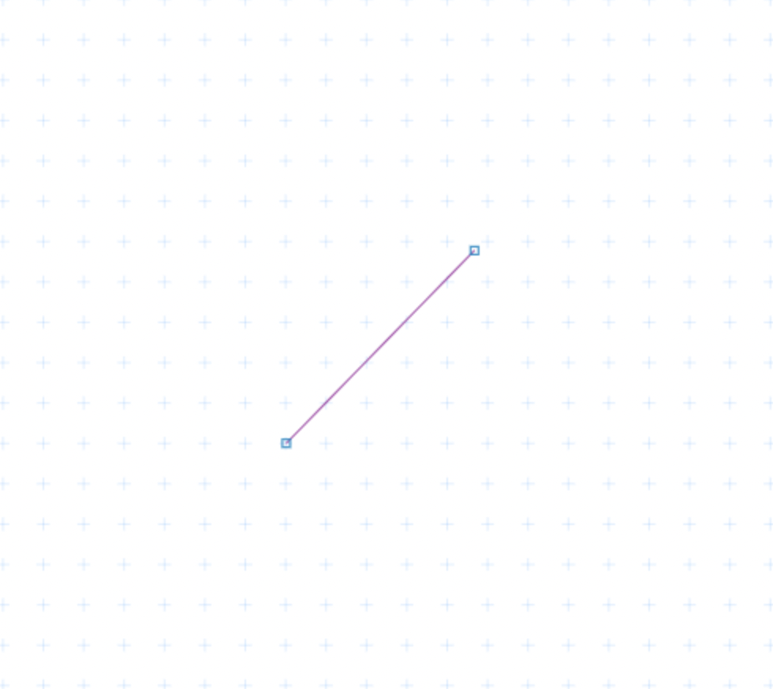

# plotboilerplate-typescript-example
A tiny example (and test for me) about how to use the PlotBoilerplate npm package.


## The test code
```typescript
import { PlotBoilerplate, Vertex, Line } from "plotboilerplate";

window.addEventListener( 'load', () => {
    
    const vertA : Vertex = new Vertex( 100,-100);
    const vertB : Vertex = new Vertex(-100, 100);
    console.log( vertA, vertB );

    const line : Line = new Line( vertA, vertB );
    
    const pb : PlotBoilerplate = new PlotBoilerplate( {
	canvas     : '#my-canvas', // element must be a <canvas> or <svg> element
	fullSize   : true
    } );
    
    pb.add( line );

} );
```

## Build
```bash
npm run build
```

## View result
Open the file `index.html` in your browser.

The page shoud roughly look like this and the line's end point should be draggable:
